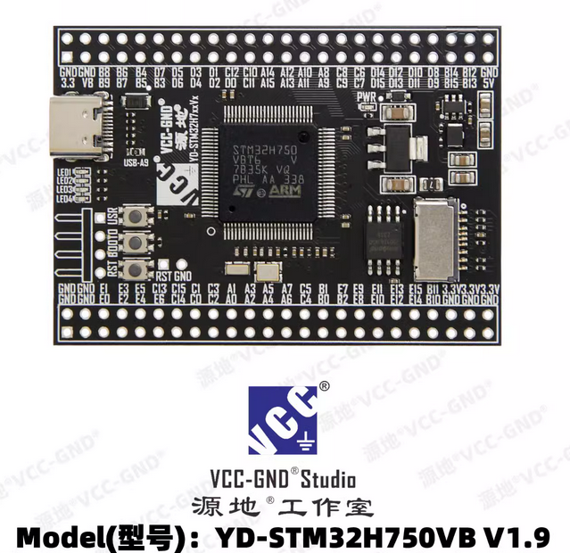

.. _yd_stm32h750vb:

YD-STM32H750VB
##############

Overview
********

The YD-STM32H750VB development board is a complete demonstration and development
platform for Arm® Cortex®-M7 core-based STM32H750VBT6 microcontroller, with
128Kbytes of Flash memory and 1 Mbytes of SRAM.

Supported Features
==================

The current Zephyr YD-STM32H750VB board supports the following features:

+-----------+------------+-------------------------------------+
| Interface | Controller | Driver/Component                    |
+===========+============+=====================================+
| NVIC      | on-chip    | nested vector interrupt controller  |
+-----------+------------+-------------------------------------+
| UART      | on-chip    | serial port-polling;                |
|           |            | serial port-interrupt               |
+-----------+------------+-------------------------------------+
| PINMUX    | on-chip    | pinmux                              |
+-----------+------------+-------------------------------------+
| GPIO      | on-chip    | gpio                                |
+-----------+------------+-------------------------------------+

Other hardware features are not yet supported on Zephyr porting.

The default configuration can be found in the defconfig file:
:zephyr_file:`boards/vcc-gnd/yd_stm32h750vb/yd_stm32h750vb_defconfig`

Pin Mapping
===========

Default Zephyr Peripheral Mapping:
----------------------------------

- UART_1_TX : PA9
- UART_1_RX : PA10
- LED_1 : PA13 (SWDIO)
- LED_2 : PA14 (SWCLK)
- LED_3 : PA15
- LED_4 : PB4
- KEY : PB3

System Clock
============

The STM32H750VB System Clock can be driven by an internal or external oscillator,
as well as by the main PLL clock. By default, the System clock
is driven by the PLL clock at 480MHz. PLL clock is feed by a 25MHz high speed external clock.

Flashing
========

There are 2 main entry points for flashing STM32H750VB SoCs, one using the ROM
bootloader, and another by using the SWD debug port (which requires additional
hardware such as ST-Link). Flashing using the ROM bootloader requires a special activation
pattern, which can be triggered by using the BOOT0 button.

Flashing an application to YD-STM32H750VB
-----------------------------------------

Here is an example for the :zephyr:code-sample:`blinky` application.

.. zephyr-app-commands::
   :zephyr-app: samples/basic/blinky
   :board: yd_stm32h750vb
   :goals: build flash

You will see the LED blinking every second.

Debugging
=========

You can debug an application in the usual way.  Here is an example for the
:ref:`hello_world` application.

.. zephyr-app-commands::
   :zephyr-app: samples/hello_world
   :board: yd_stm32h750vb
   :goals: debug

References
**********

.. _STM32H750 on www.st.com:
   https://www.st.com/en/microcontrollers-microprocessors/stm32h750-value-line.html

.. _STM32H750xx reference manual:
   https://www.st.com/resource/en/reference_manual/rm0433-stm32h742-stm32h743753-and-stm32h750-value-line-advanced-armbased-32bit-mcus-stmicroelectronics.pdf

.. _STM32H750xx datasheet:
   https://www.st.com/resource/en/datasheet/stm32h750vb.pdf
